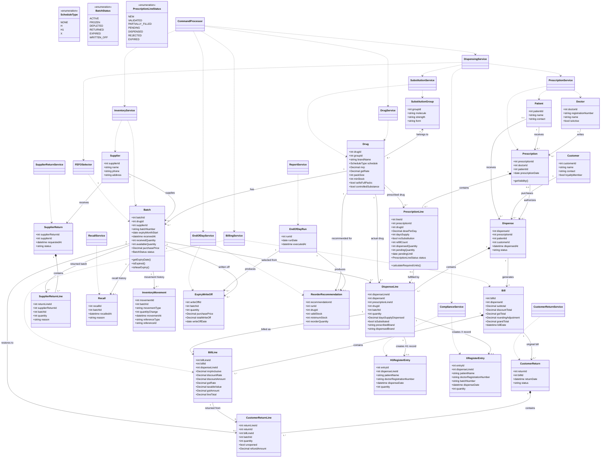

# PS-061 – Pharmacy Inventory Management System
# UML Class Diagram

```mermaid
classDiagram
direction TB

class Drug {
    +int drugId
    +int groupId
    +string brandName
    +ScheduleType schedule
    +Decimal mrp
    +Decimal gstRate
    +int packSize
    +int minStock
    +bool sellsFullPacks
    +bool controlledSubstance
}

class SubstitutionGroup {
    +int groupId
    +string molecule
    +string strength
    +string form
}

class Supplier {
    +int supplierId
    +string name
    +string phone
    +string address
}

class Batch {
    +int batchId
    +int drugId
    +int supplierId
    +string batchNumber
    +date expiryMonthStart
    +datetime receivedAt
    +int receivedQuantity
    +int availableQuantity
    +Decimal purchasePrice
    +BatchStatus status
    +getExpiryDate()
    +isExpired()
    +isNearExpiry()
}

class Doctor {
    +int doctorId
    +string registrationNumber
    +string name
    +bool isActive
}

class Patient {
    +int patientId
    +string name
    +string contact
}

class Customer {
    +int customerId
    +string name
    +string contact
    +bool loyaltyMember
}

class Prescription {
    +int prescriptionId
    +int doctorId
    +int patientId
    +date prescriptionDate
    +getValidity()
}

class PrescriptionLine {
    +int lineId
    +int prescriptionId
    +int drugId
    +Decimal dosePerDay
    +int daysSupply
    +bool noSubstitution
    +int refillCount
    +int dispensedQuantity
    +int pendingQuantity
    +date pendingUntil
    +PrescriptionLineStatus status
    +calculateRequiredUnits()
}

class Dispense {
    +int dispenseId
    +int prescriptionId
    +int patientId
    +int customerId
    +datetime dispensedAt
    +string status
}

class DispenseLine {
    +int dispenseLineId
    +int dispenseId
    +int prescriptionLineId
    +int drugId
    +int batchId
    +int quantity
    +Decimal daysSupplyDispensed
    +bool isSubstituted
    +string prescribedBrand
    +string dispensedBrand
}

class Bill {
    +int billId
    +int dispenseId
    +Decimal subtotal
    +Decimal discountTotal
    +Decimal gstTotal
    +Decimal roundingAdjustment
    +Decimal grandTotal
    +datetime billDate
}

class BillLine {
    +int billLineId
    +int billId
    +int dispenseLineId
    +Decimal mrpInclusive
    +Decimal discountRate
    +Decimal discountAmount
    +Decimal gstRate
    +Decimal taxableValue
    +Decimal gstAmount
    +Decimal lineTotal
}

class CustomerReturn {
    +int returnId
    +int billId
    +datetime returnDate
    +string status
}

class CustomerReturnLine {
    +int returnLineId
    +int returnId
    +int billLineId
    +int batchId
    +int quantity
    +bool unopened
    +Decimal refundAmount
}

class SupplierReturn {
    +int supplierReturnId
    +int supplierId
    +datetime requestedAt
    +string status
}

class SupplierReturnLine {
    +int returnLineId
    +int supplierReturnId
    +int batchId
    +int quantity
    +string reason
}

class Recall {
    +int recallId
    +int batchId
    +datetime recalledAt
    +string reason
}

class InventoryMovement {
    +int movementId
    +int batchId
    +string movementType
    +int quantityChange
    +datetime movementAt
    +string referenceType
    +string referenceId
}

class ExpiryWriteOff {
    +int writeOffId
    +int batchId
    +int quantity
    +Decimal purchasePrice
    +Decimal totalWriteOff
    +date writeOffDate
}

class H1RegisterEntry {
    +int entryId
    +int dispenseLineId
    +string patientName
    +string doctorRegistrationNumber
    +datetime dispenseDate
    +int quantity
}

class XRegisterEntry {
    +int entryId
    +int dispenseLineId
    +string patientName
    +string doctorRegistrationNumber
    +string batchNumber
    +datetime dispenseDate
    +int quantity
}

class EndOfDayRun {
    +int runId
    +date runDate
    +datetime executedAt
}

class ReorderRecommendation {
    +int recommendationId
    +int runId
    +int drugId
    +int validStock
    +int minimumStock
    +int reorderQuantity
}

class ScheduleType {
    <<enumeration>>
    NONE
    H
    H1
    X
}

class BatchStatus {
    <<enumeration>>
    ACTIVE
    FROZEN
    DEPLETED
    RETURNED
    EXPIRED
    WRITTEN_OFF
}

class PrescriptionLineStatus {
    <<enumeration>>
    NEW
    VALIDATED
    PARTIALLY_FILLED
    PENDING
    DISPENSED
    REJECTED
    EXPIRED
}

class DrugService
class InventoryService
class PrescriptionService
class FEFOSelector
class SubstitutionService
class ComplianceService
class DispensingService
class BillingService
class CustomerReturnService
class SupplierReturnService
class RecallService
class EndOfDayService
class ReportService
class CommandProcessor

SubstitutionGroup "1" <-- "0..*" Drug : belongs to

Drug "1" --> "0..*" Batch : has
Supplier "1" --> "0..*" Batch : supplies

Doctor "1" --> "0..*" Prescription : writes
Patient "1" --> "0..*" Prescription : receives

Prescription "1" *-- "1..*" PrescriptionLine : contains
Drug "1" --> "0..*" PrescriptionLine : prescribed drug

Prescription "0..1" --> "0..*" Dispense : authorizes
Customer "1" --> "0..*" Dispense : purchases
Patient "0..1" --> "0..*" Dispense : receives

Dispense "1" *-- "1..*" DispenseLine : contains
PrescriptionLine "0..1" --> "0..*" DispenseLine : fulfilled by
Drug "1" --> "0..*" DispenseLine : actual drug
Batch "1" --> "0..*" DispenseLine : selected from

Dispense "1" --> "1" Bill : generates
Bill "1" *-- "1..*" BillLine : contains
DispenseLine "1" --> "0..1" BillLine : billed as

Bill "1" --> "0..*" CustomerReturn : original bill
CustomerReturn "1" *-- "1..*" CustomerReturnLine : contains
BillLine "1" --> "0..*" CustomerReturnLine : returned from
Batch "1" --> "0..*" CustomerReturnLine : restores to

Supplier "1" --> "0..*" SupplierReturn : receives
SupplierReturn "1" *-- "1..*" SupplierReturnLine : contains
Batch "1" --> "0..*" SupplierReturnLine : returned batch

Batch "1" --> "0..*" Recall : recall history
Batch "1" --> "0..*" InventoryMovement : movement history
Batch "1" --> "0..*" ExpiryWriteOff : written off

DispenseLine "1" --> "0..1" H1RegisterEntry : creates H1 record
DispenseLine "1" --> "0..1" XRegisterEntry : creates X record

EndOfDayRun "1" --> "0..*" ExpiryWriteOff : produces
EndOfDayRun "1" --> "0..*" ReorderRecommendation : produces
Drug "1" --> "0..*" ReorderRecommendation : recommended for

DrugService ..> Drug
InventoryService ..> Batch
InventoryService ..> Supplier
PrescriptionService ..> Prescription
PrescriptionService ..> Doctor
PrescriptionService ..> Patient
FEFOSelector ..> Batch
SubstitutionService ..> Drug
SubstitutionService ..> SubstitutionGroup
ComplianceService ..> H1RegisterEntry
ComplianceService ..> XRegisterEntry
DispensingService ..> PrescriptionService
DispensingService ..> FEFOSelector
DispensingService ..> SubstitutionService
DispensingService ..> ComplianceService
BillingService ..> Bill
BillingService ..> BillLine
CustomerReturnService ..> CustomerReturn
SupplierReturnService ..> SupplierReturn
RecallService ..> Recall
EndOfDayService ..> ExpiryWriteOff
EndOfDayService ..> ReorderRecommendation
ReportService ..> EndOfDayRun
CommandProcessor ..> DrugService
CommandProcessor ..> InventoryService
CommandProcessor ..> DispensingService
CommandProcessor ..> BillingService
CommandProcessor ..> EndOfDayService
```
