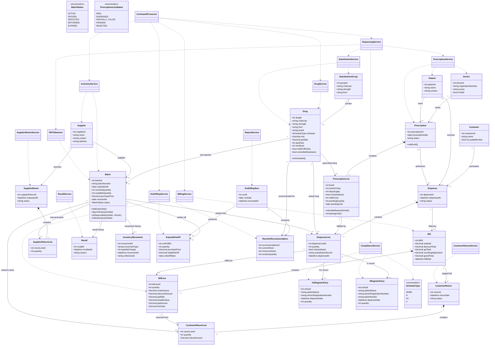

# PS-061 – Pharmacy Inventory System
## UML Class Diagram

```mermaid
classDiagram
direction TB

class Drug {
  +int drugId
  +string molecule
  +string strength
  +string form
  +string brand
  +ScheduleType schedule
  +Decimal mrp
  +Decimal gstSlab
  +int packSize
  +int minStock
  +bool sellsFullPacks
  +bool controlledSubstance
  +isScheduled()
}

class SubstitutionGroup {
  +int groupId
  +string molecule
  +string strength
  +string form
}

class Supplier {
  +int supplierId
  +string name
  +string contact
  +string address
}

class Batch {
  +int batchId
  +string batchNumber
  +date expiryMonth
  +int receivedQuantity
  +int availableQuantity
  +Decimal purchasePrice
  +date receivedAt
  +BatchStatus status
  +lastExpiryDay()
  +daysToExpiry(onDate)
  +isDispensable(onDate, chronic)
  +isNearExpiry(onDate)
}

class Doctor {
  +int doctorId
  +string registrationNumber
  +string name
  +bool isValid
}

class Patient {
  +int patientId
  +string name
  +string contact
}

class Customer {
  +int customerId
  +string name
  +bool isLoyaltyMember
}

class Prescription {
  +int prescriptionId
  +date prescriptionDate
  +string status
  +validUntil()
}

class PrescriptionLine {
  +int lineId
  +int dosePerDay
  +int daysSupply
  +bool noSubstitution
  +int refillCount
  +int pendingQuantity
  +date pendingUntil
  +calculateRequiredUnits()
  +remainingUnits()
}

class Dispense {
  +int dispenseId
  +datetime dispensedAt
  +string status
}

class DispenseLine {
  +int dispenseLineId
  +int quantity
  +bool isSubstituted
  +string substitutionRecord
  +datetime dispensedAt
}

class Bill {
  +int billId
  +Decimal subtotal
  +Decimal discountTotal
  +Decimal gstTotal
  +Decimal roundingAdjustment
  +Decimal grandTotal
  +datetime billDate
}

class BillLine {
  +int billLineId
  +int quantity
  +Decimal mrpInclusive
  +Decimal discountAmount
  +Decimal gstRate
  +Decimal taxableValue
  +Decimal gstAmount
  +Decimal lineTotal
}

class CustomerReturn {
  +int returnId
  +datetime returnDate
  +string status
}

class CustomerReturnLine {
  +int returnLineId
  +int quantity
  +Decimal refundAmount
}

class SupplierReturn {
  +int supplierReturnId
  +datetime requestedAt
  +string status
}

class SupplierReturnLine {
  +int returnLineId
  +int quantity
}

class Recall {
  +int recallId
  +datetime recalledAt
  +string reason
}

class InventoryMovement {
  +int movementId
  +string movementType
  +int quantityChange
  +datetime movementAt
  +string referenceId
}

class ExpiryWriteOff {
  +int writeOffId
  +int quantity
  +Decimal purchasePrice
  +Decimal totalWriteOff
  +date writeOffDate
}

class H1RegisterEntry {
  +int entryId
  +string patientName
  +string doctorRegistrationNumber
  +datetime dispenseDate
  +int quantity
}

class XRegisterEntry {
  +int entryId
  +string patientName
  +string doctorRegistrationNumber
  +string batchNumber
  +datetime dispenseDate
  +int quantity
}

class EndOfDayRun {
  +int runId
  +date runDate
  +datetime executedAt
}

class ReorderRecommendation {
  +int recommendationId
  +int currentStock
  +int minimumStock
  +int reorderQuantity
}

class ScheduleType {
  <<enumeration>>
  NONE
  H
  H1
  X
}

class BatchStatus {
  <<enumeration>>
  ACTIVE
  FROZEN
  DEPLETED
  RETURNED
  EXPIRED
}

class PrescriptionLineStatus {
  <<enumeration>>
  NEW
  DISPENSED
  PARTIALLY_FILLED
  PENDING
  REJECTED
}

class DrugService
class InventoryService
class PrescriptionService
class FEFOSelector
class SubstitutionService
class ComplianceService
class DispensingService
class BillingService
class CustomerReturnService
class SupplierReturnService
class RecallService
class EndOfDayService
class ReportService
class CommandProcessor

SubstitutionGroup "1" o-- "0..*" Drug : groups
Drug "1" --> "0..*" Batch : has batches
Supplier "1" --> "0..*" Batch : supplies

Doctor "1" --> "0..*" Prescription : writes
Patient "1" --> "0..*" Prescription : owns
Prescription "1" *-- "1..*" PrescriptionLine : contains
Drug "1" --> "0..*" PrescriptionLine : prescribed drug

Customer "1" --> "0..*" Dispense : purchases
Patient "0..1" --> "0..*" Dispense : receives
Prescription "0..1" --> "0..*" Dispense : authorizes

Dispense "1" *-- "1..*" DispenseLine : contains
PrescriptionLine "1" --> "0..*" DispenseLine : fulfilled by
Drug "1" --> "0..*" DispenseLine : actual drug
Batch "1" --> "0..*" DispenseLine : picked from

Dispense "1" --> "0..1" Bill : billed by
Bill "1" *-- "1..*" BillLine : contains
DispenseLine "1" --> "0..1" BillLine : billed as

Bill "1" --> "0..*" CustomerReturn : original bill
CustomerReturn "1" *-- "1..*" CustomerReturnLine : contains
BillLine "1" --> "0..*" CustomerReturnLine : returned from
Batch "1" --> "0..*" CustomerReturnLine : restores stock

Supplier "1" --> "0..*" SupplierReturn : receives
SupplierReturn "1" *-- "1..*" SupplierReturnLine : contains
Batch "1" --> "0..*" SupplierReturnLine : returned batch

Batch "1" --> "0..*" Recall : recall history
Batch "1" --> "0..*" InventoryMovement : movement history
Batch "1" --> "0..*" ExpiryWriteOff : written off

DispenseLine "1" --> "0..1" H1RegisterEntry : H1 record
DispenseLine "1" --> "0..1" XRegisterEntry : X record

EndOfDayRun "1" --> "0..*" ExpiryWriteOff : produces
EndOfDayRun "1" --> "0..*" ReorderRecommendation : produces
Drug "1" --> "0..*" ReorderRecommendation : recommended for

DrugService ..> Drug
InventoryService ..> Batch
InventoryService ..> Supplier
PrescriptionService ..> Prescription
PrescriptionService ..> Doctor
PrescriptionService ..> Patient
FEFOSelector ..> Batch
SubstitutionService ..> Drug
SubstitutionService ..> SubstitutionGroup
ComplianceService ..> ScheduleType
ComplianceService ..> H1RegisterEntry
ComplianceService ..> XRegisterEntry
DispensingService ..> PrescriptionService
DispensingService ..> FEFOSelector
DispensingService ..> SubstitutionService
DispensingService ..> ComplianceService
BillingService ..> Bill
BillingService ..> BillLine
CustomerReturnService ..> CustomerReturn
SupplierReturnService ..> SupplierReturn
RecallService ..> Recall
EndOfDayService ..> ExpiryWriteOff
EndOfDayService ..> ReorderRecommendation
ReportService ..> EndOfDayRun
CommandProcessor ..> DrugService
CommandProcessor ..> InventoryService
CommandProcessor ..> DispensingService
CommandProcessor ..> BillingService
CommandProcessor ..> EndOfDayService
```
